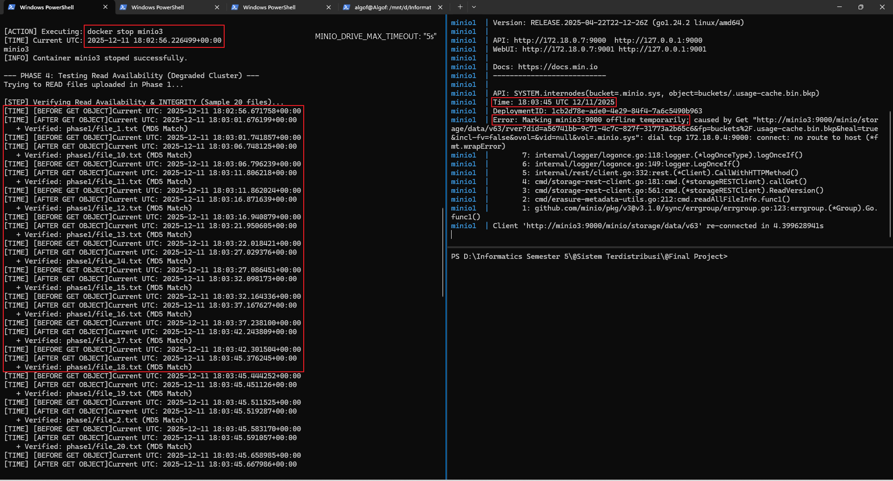
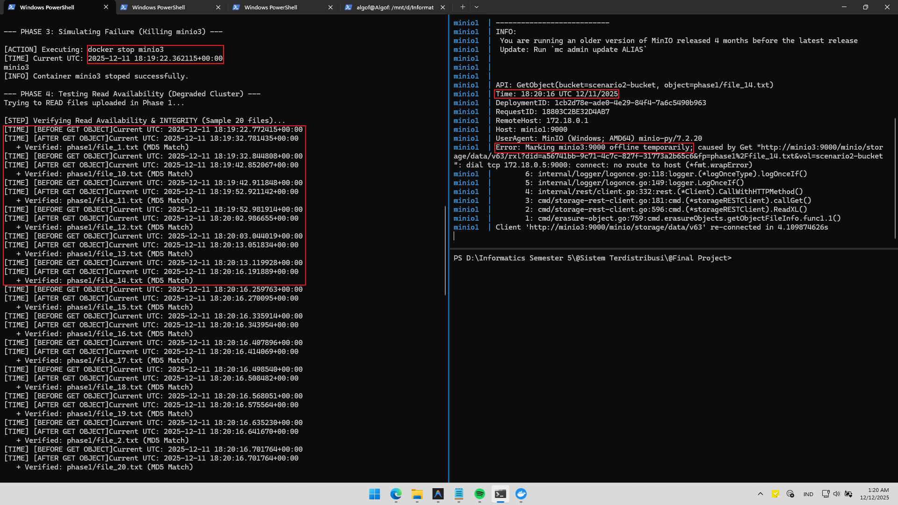
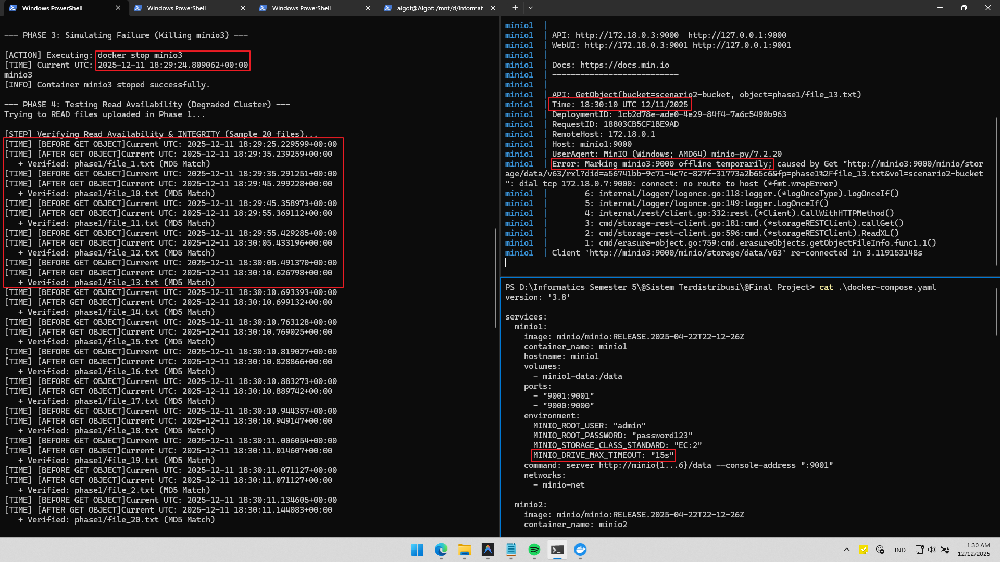
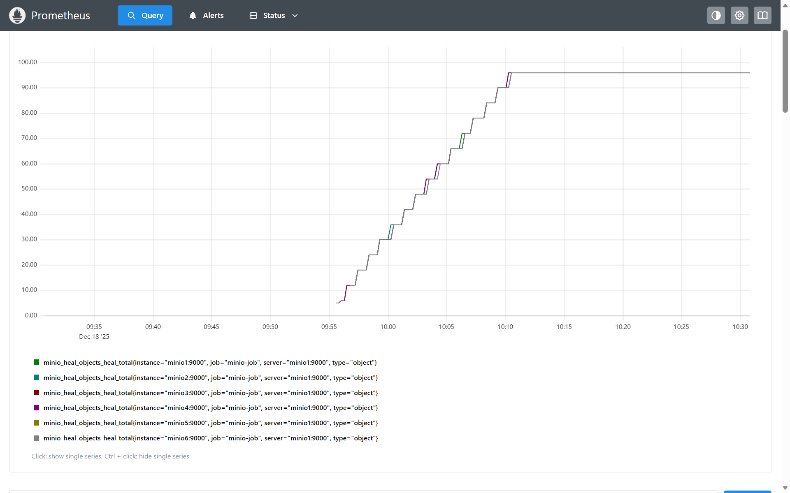

# Laporan Skenario 2: Node Failure & Self-Healing

| Name           | NRP        | Kelas     |
| ---            | ---        | ----------|
| Algof Kristian Zega | 5025231235 | Sistem Terdistribusi (T) |
| Gregorius Setiadharma | 5025231268 | Sistem Terdistribusi (T) |
| Valensio Arvin Putra Setiawan | 5025231273 | Sistem Terdistribusi (T) |
| Muhammad Davin Aulia Risky | 5025231275 | Sistem Terdistribusi (T) |

## 1. Pendahuluan
### 1.1 Tujuan Eksperimen

Menguji ketahanan (resilience), ketersediaan (availability), dan performa (performance) klaster MinIO ketika node mengalami kegagalan (failure), serta kemampuan sistem untuk pulih (self-healing).

### 1.2 Deskripsi Lingkungan

Kami melakukan percobaan pada environment:
- Jumlah Node: 6 (minio1, minio2, minio3, minio4, minio5, minio6).
- Setup Storage: Distributed Mode (Erasure Coding enabled).
- Tools: `read.py` script, `write.py` script, docker-compose.yaml, Docker, virtual environment, 20 dummy file dengan size tepat 10MB.

## 2. Metodologi Pengujian
Eksperimen dilakukan berdasarkan skenario jumlah node yang mengalami kegagalan. Pada setiap skenario, dilakukan pengujian terhadap dua operasi utama: **Read Availability** (Membaca data yang sudah ada) dan **Write Availability** (Menulis data baru).

1.  **Phase 1 & 2: Baseline (Healthy State)**
    *   Kondisi: Semua 6 node sehat.
    *   Tindakan: Upload 20 file (Write) dan Download/Verify 20 file (Read).
2.  **Scenario 2A: 1 Node Failure**
    *   Kondisi: 1 node dimatikan (`minio3`).
    *   **Test Read**: Mencoba membaca data yang diupload saat kondisi sehat.
    *   **Test Write**: Mencoba mengupload data baru.
3.  **Scenario 2B: 2 Node Failure**
    *   Kondisi: 2 node dimatikan (`minio3`, `minio5`).
    *   **Test Read**: Mencoba membaca data.
    *   **Test Write**: Mencoba mengupload data baru.
4.  **Scenario 2C: 3 Node Failure**
    *   Kondisi: 3 node dimatikan (`minio3`, `minio5`, `minio6`).
    *   **Test Read**: Mencoba membaca data.
    *   **Test Write**: Mencoba mengupload data baru.
5.  **Phase Recovery**
    *   Tindakan: Menyalakan kembali node yang mati satu per satu dan mengamati proses *rejoin*.

## 3. Hasil Eksperimen

### 3.1 Baseline Performance (Healthy State)
*   **Write (Upload)**:
    *   *Observasi*: Ketika semua masih menyala dengan baik, MinIO berhasil mengupload 20 file dummy ke bucket. MinIO tidak kesulitan untuk menghubungi setiap node dari minio1 sampai minio6. Operasi write dan read dan write berhasil dijalankan dengan waktu yang lumayan cepat. Total waktu yang diperlukan untuk mengupload 20 file dummy dengan size 10MB adalah sekitar 2.34 detik.
*   **Read (Download & Verify)**:
    *   *Observasi*: Total waktu yang diperlukan untuk membaca 20 file dummy dengan size 10MB adalah sekitar 1.30 detik. Data yang dibaca juga terverifikasi checksumnya dengan file asli. Artinya tidak ada corruption dalam upload file.
    *   *Bukti*: 
        ```log
        --- PHASE 1: Baseline Upload (All Nodes Healthy) ---

        [STEP] Uploading 20 files with prefix 'phase1'...
        + Uploaded: phase1/file_1.txt
        + Uploaded: phase1/file_10.txt
        + Uploaded: phase1/file_11.txt
        + Uploaded: phase1/file_12.txt
        + Uploaded: phase1/file_13.txt
        + Uploaded: phase1/file_14.txt
        + Uploaded: phase1/file_15.txt
        + Uploaded: phase1/file_16.txt
        + Uploaded: phase1/file_17.txt
        + Uploaded: phase1/file_18.txt
        + Uploaded: phase1/file_19.txt
        + Uploaded: phase1/file_2.txt
        + Uploaded: phase1/file_20.txt
        + Uploaded: phase1/file_3.txt
        + Uploaded: phase1/file_4.txt
        + Uploaded: phase1/file_5.txt
        + Uploaded: phase1/file_6.txt
        + Uploaded: phase1/file_7.txt
        + Uploaded: phase1/file_8.txt
        + Uploaded: phase1/file_9.txt
        [RESULT] Uploaded 20/20 files in 2.34s
        ```

### 3.2 Scenario 2A: 1 Node Failure (`minio3` Down)
*   **Read Availability (Membaca file lama)**:
    *   *Ketersediaan*: **BERHASIL**. MinIO tetap berhasil melayani permintaan BACA (Read) karena jumlah node yang hidup (5 node) masih memenuhi kuorum baca (Read Quorum: 4).
    *   *Observasi Latency*: Terobservasi adanya peningkatan waktu respons (latency) yang signifikan. MinIO membutuhkan waktu beberapa detik (latency spike) untuk mendeteksi kegagalan node sebelum akhirnya sukses mengambil data dari node lain. Setelah node ditandai offline (steady state), latency kembali normal.
    *   *Integritas Data*: Checksum verification berhasil dilakukan. Hasil pengujian menunjukkan bahwa hash MD5 dari file yang diunduh sama dengan hash file aslinya (Tidak corrupt).
    *   *Bukti*: 
        ```log
        --- PHASE 3: Simulating Failure 1 Node (Killing minio3) ---

        [ACTION] Executing: docker stop minio3
        [TIME] Current UTC: 2025-12-18 16:44:05.683910+00:00
        minio3
        [INFO] Container minio3 stoped successfully.
        ```
        ```log
        2025-12-18T16:44:56.584850115Z Error: Marking minio3:9000 offline temporarily; caused by Get "http://minio3:9000/minio/storage/data/v63/rxl?did=1ab09247-394d-4907-ae17-178452b2f536&fp=phase1%2Ffile_14.txt&vol=scenario2-bucket": dial tcp 172.18.0.8:9000: connect: no route to host (*fmt.wrapError)
        ```
*   **Write Availability (Upload file baru)**:
    *   *Ketersediaan*: **BERHASIL**. MinIO tetap berhasil melayani permintaan TULIS (Write) karena jumlah node yang hidup (5 node) masih memenuhi kuorum tulis (Write Quorum: 4).
    *   *Observasi*: Terobservasi adanya peningkatan waktu respons (latency) yang signifikan. MinIO membutuhkan waktu beberapa detik (latency spike) untuk mendeteksi kegagalan node sebelum akhirnya sukses menulis data baru ke dalam cluster. Setelah node ditandai offline (steady state), latency kembali normal.
    *   *Integritas Data*: Checksum verification berhasil dilakukan. Hasil pengujian menunjukkan bahwa hash MD5 dari file yang diunduh sama dengan hash file aslinya (Tidak corrupt).
    *   *Bukti*: 
        ```log
        --- PHASE 3: Simulating Failure 1 Node (Killing minio3) ---

        [ACTION] Executing: docker stop minio3
        [TIME] Current UTC: 2025-12-18 15:51:42.223114+00:00
        minio3
        [INFO] Container minio3 stoped successfully.
        ```
        ```log
        2025-12-18T15:51:52.654438421Z Error: Marking minio3:9000 offline temporarily; caused by Post "http://minio3:9000/minio/storage/data/v63/cfile?did=1ab09247-394d-4907-ae17-178452b2f536&fp=3378a558-4497-493d-ba64-0824d8c4c36bx1766073102653095075%2Fpart.1&length=1310880&ovol=scenario2-bucket&vol=.minio.sys%2Ftmp": dial tcp 172.18.0.2:9000: i/o timeout (*fmt.wrapError)
        ```
    

### 3.3 Scenario 2B: 2 Node Failure (`minio3`, `minio5` Down)
*   **Read Availability**:
    *   *Ketersediaan*: **BERHASIL**. MinIO masih tetap berhasil melayani permintaan BACA (Read) karena sisa 4 node masih cukup untuk memenuhi Read Quorum.
    *   *Observasi Latency*: Observasi menarik pada fase ini adalah waktu adaptasi yang lebih cepat dibandingkan saat kegagalan satu node. MinIO mendeteksi node kedua offline lebih cepat, sehingga jeda waktu pembacaan lebih singkat dibanding fase sebelumnya.
    *   *Integritas Data*: Checksum verification berhasil dilakukan (MD5 Match).
    *   *Bukti*: 
        ```log
        --- PHASE 6: Simulating Failure 2 Node (Killing minio5) ---

        [ACTION] Executing: docker stop minio5
        [TIME] Current UTC: 2025-12-18 16:44:58.863088+00:00
        minio5
        [INFO] Container minio5 stoped successfully.
        ```
        ```log
        2025-12-18T16:45:10.207362811Z Error: Marking minio5:9000 offline temporarily; caused by Get "http://minio5:9000/minio/storage/data/v63/rxl?did=05be34ed-937a-4ad0-9502-7a32734886b7&fp=phase1%2Ffile_10.txt&vol=scenario2-bucket": lookup minio5 on 127.0.0.11:53: no such host (*fmt.wrapError)
        ```
*   **Write Availability**:
    *   *Ketersediaan*: **BERHASIL**. MinIO masih tetap berhasil melayani permintaan TULIS (Write) karena sisa 4 node masih cukup untuk memenuhi Write Quorum.
    *   *Observasi*: Observasi menarik pada fase ini adalah waktu adaptasi yang lebih cepat dibandingkan saat kegagalan satu node. MinIO mendeteksi node kedua offline lebih cepat, sehingga jeda waktu penulisan lebih singkat dibanding fase sebelumnya.
    *   *Integritas Data*: Checksum verification berhasil dilakukan (MD5 Match).
    *   *Bukti*: 
        ```log
        --- PHASE 6: Simulating Failure 2 Node (Killing minio5) ---

        [ACTION] Executing: docker stop minio5
        [TIME] Current UTC: 2025-12-18 15:52:00.046266+00:00
        minio5
        [INFO] Container minio5 stoped successfully.
        ```
        ```log
        2025-12-18T15:52:00.181878053Z Error: Marking minio5:9000 offline temporarily; caused by Get "http://minio5:9000/minio/storage/data/v63/rver?did=05be34ed-937a-4ad0-9502-7a32734886b7&fp=phase3%2Ffile_9.txt&heal=true&incl-fv=false&ovol=&vid=null&vol=scenario2-bucket": dial tcp 172.18.0.4:9000: connect: connection refused (*fmt.wrapError)
        ```
### 3.4 Scenario 2C: 3 Node Failure (`minio3`, `minio5`, `minio6` Down)
*   **Read Availability**:
    *   *Ketersediaan*: **GAGAL**.
    *   *Observasi*: Ketika tiga node mati, MinIO tidak dapat melayani permintaan baca (read) karena jumlah node yang masih aktif (3 node) tidak memenuhi kuorum baca (Read Quorum: 4). MinIO terjebak dalam endless loop atau timeout saat mencoba menghubungi node.
    *   *Integritas Data*: Tidak dapat diverifikasi karena file gagal diunduh.
    *   *Bukti*: 
        ```log
        2025-12-18T18:29:30.536554370Z API: SYSTEM.grid
        2025-12-18T18:29:30.536563211Z Time: 18:29:30 UTC 12/18/2025
        2025-12-18T18:29:30.536569911Z DeploymentID: ec944459-88b3-4f1f-80ea-af8e82cd1d88
        2025-12-18T18:29:30.536576353Z Error: grid: http://minio1:9000 re-connecting to http://minio6:9000: dial tcp 172.18.0.4:9000: i/o timeout (*net.OpError) Sleeping 0s (3) (*fmt.wrapError)
        2025-12-18T18:29:30.536583026Z        6: internal/logger/logonce.go:118:logger.(*logOnceType).logOnceIf()
        2025-12-18T18:29:30.536589317Z        5: internal/logger/logonce.go:149:logger.LogOnceIf()
        2025-12-18T18:29:30.536595266Z        4: internal/grid/connection.go:59:grid.gridLogOnceIf()
        2025-12-18T18:29:30.536601349Z        3: internal/grid/connection.go:672:grid.(*Connection).connect.func1()
        2025-12-18T18:29:30.536607625Z        2: internal/grid/connection.go:678:grid.(*Connection).connect()
        2025-12-18T18:29:30.536613803Z        1: internal/grid/connection.go:275:grid.newConnection.func3()
        ```
*   **Write Availability**:
    *   *Ketersediaan*: **GAGAL**.
    *   *Observasi*: (Jelaskan bahwa upload gagal total karena Quorum Write 4 tidak tercapai dengan hanya 3 node hidup).
    *   *Bukti*: 
        ```log
        --- PHASE 10: Testing Write Availability (3 Node Mati) ---
        Trying to WRITE files uploaded in Phase 1 (Again)...

        [STEP] Uploading 20 files with prefix 'phase6'...
        [TIME] [BEFORE FPUT OBJECT]Current UTC: 2025-12-18 15:52:08.143855+00:00
        X Failed to upload file_1.txt: S3 operation failed; code: SlowDownWrite, message: Resource requested is unwritable, please reduce your request rate, resource: /scenario2-bucket/phase6/file_1.txt, request_id: 18825A272B133EB1, host_id: e0c385c033c4356721cc9121d3109c9b9bfdefb22fd2747078acd22328799e36, bucket_name: scenario2-bucket, object_name: phase6/file_1.txt
        [TIME] [BEFORE FPUT OBJECT]Current UTC: 2025-12-18 15:52:08.311769+00:00
        X Failed to upload file_9.txt: S3 operation failed; code: SlowDownWrite, message: Resource requested is unwritable, please reduce your request rate, resource: /scenario2-bucket/phase6/file_9.txt, request_id: 18825A2734EF0EDF, host_id: e0c385c033c4356721cc9121d3109c9b9bfdefb22fd2747078acd22328799e36, bucket_name: scenario2-bucket, object_name: phase6/file_9.txt
        [RESULT] Uploaded 0/20 files in 0.18s
        ```

### 3.5 Recovery Phase
*   **Tindakan**: `docker start minio3`, `docker start minio5`, `docker start minio6`.
*   **Observasi**: Apakah node berhasil *rejoin* ke cluster? Apakah ada error saat startup?

    Pada kondisi tiga node mengalami kegagalan dan satu node berhasil *rejoin*, MinIO belum dapat mengembalikan operasi *read* dan *write*. Namun, ketika dua node berhasil *rejoin*, MinIO kembali dapat melayani operasi *read* dan *write*.

*   **Bukti**: 
    ```log
    (venv) PS D:\Informatics Semester 5\@Sistem Terdistribusi\@FP SisTer> python .\interactive.py start --node minio6

    [ACTION] Executing: docker start minio6
    [TIME] Current UTC: 2025-12-18 18:29:52.448275+00:00
    minio6
    [INFO] Successfully started minio6.
    (venv) PS D:\Informatics Semester 5\@Sistem Terdistribusi\@FP SisTer> python .\interactive.py start --node minio5

    [ACTION] Executing: docker start minio5
    [TIME] Current UTC: 2025-12-18 18:30:03.949558+00:00
    minio5
    [INFO] Successfully started minio5.
    (venv) PS D:\Informatics Semester 5\@Sistem Terdistribusi\@FP SisTer> python .\interactive.py start --node minio3

    [ACTION] Executing: docker start minio3
    [TIME] Current UTC: 2025-12-18 18:30:44.089299+00:00
    minio3
    [INFO] Successfully started minio3.
    ```
    ```log
    2025-12-18T18:30:23.834169511Z Client 'http://minio3:9000/minio/storage/data/v63' re-connected in 1m38.935670659s
    2025-12-18T18:30:31.076479381Z Client 'http://minio5:9000/minio/storage/data/v63' re-connected in 1m6.118543818s
    ```

## 4. Analisis dan Pembahasan

### 4.1 Mekanisme Deteksi Kegagalan & Timeout (Read Operation)
Berdasarkan observasi di Scenario 2A (1 Node Fail), MinIO tidak langsung menandai node sebagai *offline* seketika. Terdapat mekanisme timeout untuk mencegah *false positives*.

Temuan eksperimen ini menunjukkan bahwa threshold timeout MinIO berbasis **durasi waktu**, bukan jumlah request yang gagal.
*   Jika tanpa environment variable `MINIO_DRIVE_MAX_TIMEOUT`, timeout internal adalah **10 detik**.
*   Percobaan mengubah timeout membuktikan konsistensi durasi ini.

**Bukti Eksperimen:**
*   Timeout 5s menghasilkan log:
    
*   Timeout 10s menghasilkan log:
    
*   Timeout 15s menghasilkan log:
    

Kesimpulannya, latency spike yang terjadi di Phase 4 adalah akibat operasi *retry* MinIO selama periode timeout.

**Analisis Perbedaan Kecepatan Deteksi (Node 1 vs Node 2) pada Operasi Read:**
Berdasarkan log error yang diamati, terdapat perbedaan mendasar pada jenis kesalahan yang diterima MinIO, yang menjelaskan mengapa deteksi pada node kedua jauh lebih cepat:

1.  **Fase 1 Node Mati (Lambat - Timeout)**:
    *   Error: `dial tcp ... i/o timeout`
    *   **Analisis**: Client kemungkinan mencoba menggunakan koneksi TCP yang *sudah terbuka* (keep-alive) atau menunggu respon dari network socket yang menggantung. Client harus menunggu sepenuhnya hingga durasi timeout habis (10 detik) sebelum menyatakan request gagal.
    
2.  **Fase 2 Node Mati (Cepat - Instant Failure)**:
    *   Error: `dial tcp ... connect: connection refused`
    *   **Analisis**: MinIO mencoba membuka koneksi baru (*dialing*) ke target. Karena container sudah berhenti total dan port tidak aktif, kernel sistem operasi host langsung membalas dengan paket **TCP RST** (Reset). Hal ini menyebabkan penolakan koneksi terjadi secara **instan** tanpa perlu menunggu durasi timeout.

Fenomena ini menjelaskan observasi mengapa pada skenario kegagalan kedua, sistem merespons jauh lebih cepat dibandingkan kegagalan pertama.

**Analisis Perbedaan Kecepatan Deteksi (Node 1 vs Node 2) pada Operasi Write:**
Pola yang sama juga teramati pada operasi *Write*, dengan alasan teknis yang serupa namun dengan implikasi yang lebih kritikal karena kebutuhan akan konsistensi data:

1.  **Fase 1 Node Mati (Lambat - Locking Timeout)**:
    *   Error: `i/o timeout` saat mencoba *acquire lock*.
    *   **Analisis**: Saat mencoba menulis, MinIO harus mendapatkan *write lock* dari kuorum node. Jika minio3 mati mendadak, koneksi ke node tersebut "menggantung". MinIO menunggu respon lock sampai batas timeout aplikasi tercapai sebelum menyerah dan melanjutkan dengan node lain. Ini menyebabkan latensi tinggi yang dirasakan user.

2.  **Fase 2 Node Mati (Cepat - Instant Rejection)**:
    *   Error: `connection refused`.
    *   **Analisis**: Sama seperti operasi Read, ketika minio5 mati total dan port tertutup, upaya MinIO untuk menghubungi node tersebut langsung ditolak oleh kernel (*TCP RST*). MinIO segera tahu node tersebut tidak tersedia tanpa perlu membuang waktu menunggu lock timeout, sehingga proses *failover* ke node tersisa terjadi jauh lebih cepat.

**Analisis Perbedaan Durasi Deteksi (Read vs Write):**
Selain perbedaan antar-node, terdapat juga anomali perbedaan waktu deteksi antara operasi *Read* dan *Write* pada skenario 1 Node Failure:
*   **Write Operation (~10 detik)**: Error yang muncul adalah `i/o timeout`. Ini menandakan bahwa MinIO secara aktif membatalkan request karena *quorum write* memerlukan *locking* yang ketat. Jika lock tidak didapat dalam ambang batas aplikasi (10s), MinIO langsung memutus koneksi untuk menjaga konsistensi cluster.
*   **Read Operation (~50 detik)**: Error yang muncul adalah `no route to host`. Pada operasi *Read*, MinIO lebih toleran dan bergantung pada respon dari stack jaringan (OS/Docker). Durasi 50 detik kemungkinan besar adalah waktu yang dibutuhkan oleh stack jaringan atau ARP cache untuk kadaluwarsa sebelum akhirnya sistem operasi mengirimkan sinyal bahwa host benar-benar tidak dapat dijangkau. MinIO terus mencoba (*retry*) selama periode ini karena operasi *read* bersifat idempoten dan tidak destruktif.

### 4.2 Mekanisme On-the-Fly Reconstruction (Read Logic)
Saat request READ masuk ketika node mati (selama Quorum terpenuhi), MinIO melakukan rekonstruksi data secara langsung (*on-the-fly*):
1.  Memeriksa availability blok data di erasure set.
2.  Jika blok data utama hilang (ada di node mati), MinIO mengambil parity block.
3.  Melakukan perhitungan matematika (Erasure Coding) untuk me-restore blok yang hilang.
4.  Mengirimkan data hasil rekonstruksi ke klien.

Proses ini **tidak** melakukan *permanent healing* ke disk (hanya di memori untuk melayani request tersebut). Penyembuhan permanen (*healing*) berjalan di background terpisah.
Gambar heal object:

Proses *healing object* akan berhenti apabila seluruh node yang sebelumnya mati telah kembali menyala atau telah tersedia node pengganti.

### 4.3 Analisis Write Quorum dan Ketersediaan Tulis
Pada operasi **Write**, MinIO membutuhkan konfirmasi sukses dari sejumlah drive tertentu untuk menganggap operasi berhasil (*Write Quorum*).
*   Dalam setup Erasure Coding `N=6`, standard **Write Quorum** adalah `N/2 + 1` = **4 Node**.
*   **Scenario 2A (5 Node Hidup)**: 5 > 4. Write Berhasil.
*   **Scenario 2B (4 Node Hidup)**: 4 == 4. Write Berhasil (Batas kritis).
*   **Scenario 2C (3 Node Hidup)**: 3 < 4. Write Gagal.

Hal ini menjelaskan mengapa pada Scenario 2C, sistem menjadi *Read-Only* atau bahkan *Unavailable* sepenuhnya tergantung konfigurasi, sedangkan di Scenario 2B sistem masih *Fully Available* meskipun kehilangan 33% infrastruktur.

### 4.4 Konsistensi Data (Strict Consistency)
MinIO menjamin **Strict Consistency**. Artinya, setelah operasi Write berhasil, data tersebut dijamin dapat langsung dibaca (Read-after-Write).
*   Meskipun cluster dalam kondisi *degraded* (Node mati), klien tidak mendapatkan data yang korup atau *partial*.
*   Klien entah mendapatkan data full (valid) atau error. Hasil eksperimen menunjukkan data valid (MD5 match) di semua skenario yang berhasil.

### 4.5 Teori Erasure Coding
MinIO menggunakan algoritma Erasure Coding untuk memecah objek menjadi fragmen data (Data Blocks) dan fragmen paritas (Parity Blocks). Berdasarkan konfigurasi cluster 6 node yang kami gunakan:

*   **Total Set (N)**: 6 Node.
*   **Konfigurasi**: 4 Data Blocks (K) + 2 Parity Blocks (M).
*   **Read Quorum (K)**: 4 Node.
    MinIO memerlukan minimal 4 node aktif untuk merekonstruksi data. Ini menjelaskan mengapa skenario kegagalan 1 dan 2 node (**Scenario 2A & 2B**) tetap berhasil (sisa 4 node), sedangkan kegagalan 3 node (**Scenario 2C**) gagal (sisa 3 node).
*   **Write Quorum (N/2 + 1)**: 4 Node.
    Operasi tulis memerlukan persetujuan dari minimal 4 node untuk menjamin konsistensi & durabilitas. Sama seperti Read, batas toleransi maksimal adalah kehilangan 2 node.

### 4.6 Dampak terhadap Performa
Hasil eksperimen menunjukkan pola kinerja yang konsisten antara fase sehat dan fase degradasi:
1.  **Baseline (Sehat)**: Performa sangat optimal dengan latensi rendah (Upload ~2.34s, Read ~1.30s).
2.  **Unsteady State (Saat Kejadian Gagal)**: Terjadi **degradasi kinerja sesaat (Latency Spike)** yang ekstrem.
    *   *Read*: Spike hingga ~50s (menunggu OS timeout).
    *   *Write*: Spike hingga ~10s (menunggu Locking timeout).
    Hal ini disebabkan oleh mekanisme *retry* dan *timeout* sistem, bukan karena penurunan *throughput* transfer data.
3.  **Steady State (Setelah Deteksi)**: Setelah node yang mati sukses ditandai sebagai *offline*, performa kembali **stabil dan mendekati normal**. MinIO secara cerdas mengabaikan node mati dan langsung menghubungi node sehat, sehingga user hampir tidak merasakan perbedaan performa dibandingkan kondisi baseline.

## 5. Kesimpulan
Eksperimen Skenario 2 ini berhasil mendemonstrasikan kapabilitas *High Availability* dan *Self-Healing* dari MinIO dalam menghadapi kegagalan node. Berdasarkan hasil pengujian, dapat disimpulkan bahwa:

1.  **Ketahanan Terhadap Kegagalan (Resilience)**:
    Dengan konfigurasi *Erasure Coding* 6 Node (4 Data + 2 Parity), klaster MinIO terbukti mampu bertahan meskipun kehilangan **2 Node sekaligus (33% infrastruktur)**. Operasi *Read* dan *Write* tetap berjalan normal selama jumlah node hidup memenuhi *Quorum* (4 Node). Sistem baru mengalami kegagalan total ketika 3 node mati.

2.  **Perilaku Latensi & Deteksi Kegagalan**:
    Meskipun ketersediaan data terjamin, transisi dari kondisi sehat ke kondisi *failure* (Unsteady State) menimbulkan dampak performa yang signifikan.
    *   Deteksi kegagalan pada operasi **Write** lebih cepat (~10s) karena mekanisme *locking timeout* aplikasi.
    *   Deteksi pada operasi **Read** lebih lambat (~50s) karena bergantung pada *network timeout* sistem operasi.
    *   Namun, setelah node berhasil ditandai offline (Steady State), performa kembali stabil tanpa degradasi yang berarti.

3.  **Integritas Data Sempurna**:
    Mekanisme *Erasure Coding* dan *Strict Consistency* bekerja sesuai teori. Dalam semua skenario yang berhasil (1 & 2 Node mati), tidak ditemukan adanya korupsi data. File yang diunduh memiliki *hash MD5* yang identik dengan aslinya, membuktikan bahwa MinIO tidak mengorbankan integritas data demi ketersediaan (*CP in CAP Theorem, effectively*).

Secara keseluruhan, MinIO terbukti andal sebagai solusi penyimpanan terdistribusi yang tangguh, dengan catatan bahwa administrator sistem perlu memitigasi potensi *latency spike* saat kejadian kegagalan node pertama kali terjadi.

## 6. Daftar Pustaka

- [minio-metrics-v2-documentation](https://docs.min.io/enterprise/aistor-object-store/operations/monitoring/metrics-and-alerts/metrics-v2/)
- [minio-recover-after-node-failure](https://docs.min.io/enterprise/aistor-object-store/operations/failure-and-recovery/recover-after-node-failure/)